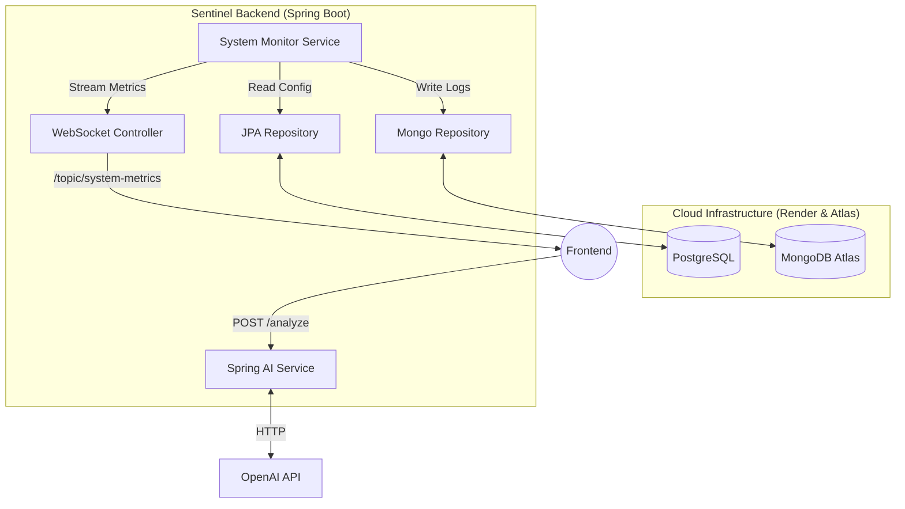

# 🛡️ Sentinel API - AI-Powered Infrastructure Monitoring


[](https://sentinel-front.vercel.app)

**Sentinel API** is the backend core of the Sentinel observability platform. It simulates a high-traffic server farm, ingests real-time metrics, detects critical anomalies, and leverages **Generative AI** to provide automated Root Cause Analysis (RCA) for SRE teams.

This project demonstrates a modern **Event-Driven Architecture** using WebSockets for live data streaming and **Polyglot Persistence** (SQL + NoSQL) for optimal data management.

---

## 🏗️ System Architecture

The system follows a layered architecture with a dedicated simulation engine that broadcasts metrics via STOMP WebSockets.



## 🚀 Key Features

* **⚡ Real-Time Simulation Engine:** Generates CPU, RAM, and Temperature metrics for a distributed server cluster with simulated entropy and failures.
* **📡 WebSocket Broadcasting:** Pushes metrics to connected clients with sub-100ms latency using **Spring WebSocket (STOMP)**.
* **🧠 AI-Powered Diagnostics:** Integrates with **OpenAI (GPT-4o)** via **Spring AI**. When a server crashes, the system generates a context-aware diagnosis and suggested fix.
* **💾 Polyglot Persistence:**
    * **PostgreSQL:** Stores relational data (Server metadata, configuration, users).
    * **MongoDB:** Stores high-volume unstructured logs and incident history.
* **🧹 Smart Data Management:** Implements **TTL (Time-To-Live)** indexes in MongoDB to automatically purge logs older than 1 hour, preventing data fatigue.
* **❄️ Alert Debouncing:** Intelligent logic to prevent alert flooding during sustained critical failures.
* **🐳 Fully Containerized:** Application and databases are orchestrated via **Docker Compose** (`compose.yaml`) for local development.

---

## 🛠️ Tech Stack

* **Language:** Java 21
* **Framework:** Spring Boot 3.4
* **Build Tool:** Maven
* **AI Integration:** Spring AI (OpenAI Provider)
* **Real-time Protocol:** STOMP over WebSocket
* **Databases:**
    * Spring Data JPA (Hibernate/Postgres)
    * Spring Data MongoDB
* **DevOps:** Docker & Docker Compose, Render (Cloud)

---

## 🔌 API Endpoints

### 📡 Real-Time (WebSocket)
* **Endpoint:** `/system-metrics` (WebSocket Handshake)
* **Topic:** `/topic/system-metrics`
    * *Payload:* `SystemStatusDto` (Contains list of servers with CPU, RAM, Status, Error Details).

### 🌐 REST API

| Method | Endpoint | Description |
| :--- | :--- | :--- |
| `GET` | `/api/logs` | Retrieve paginated history of system incidents (MongoDB). |
| `POST` | `/api/ai/analyze` | Request an AI analysis for a specific error string. |
| `PATCH` | `/api/ai/logs/{id}/save` | Persist the AI diagnosis into a specific log entry. |

---

## ⚡ Getting Started (Local Development)

### Prerequisites
* Docker & Docker Compose
* Java 21 JDK (if running without Docker)
* **OpenAI API Key** (Required for AI features)

### 1. Clone the Repository
```bash
git clone [https://github.com/your-username/sentinel-backend.git](https://github.com/your-username/sentinel-backend.git)
cd sentinel-backend
```

### 2. Configure Environment
Create a `.env` file or export the variables in your terminal:

```bash
export OPENAI_API_KEY=sk-your-key-here
```

### 3. Run Infrastructure
Start PostgreSQL and MongoDB containers using Docker Compose:
```bash
docker-compose up -d
```

### 4. Run the Application
You can run the app using the Maven wrapper:

```bash
./mvnw spring-boot:run
```
*The application will start on `http://localhost:8080`.*

---

## ☁️ Cloud Deployment (Production)

The live version deviates from the local setup to leverage managed cloud services:

* **Backend:** Deployed on **Render** (Docker Web Service).
* **Database (SQL):** Managed **PostgreSQL** instance on Render.
* **Database (NoSQL):** **MongoDB Atlas** Cluster.

### Required Environment Variables
If you deploy this yourself, ensure these variables are set in your cloud provider:

| Variable | Description |
| :--- | :--- |
| `OPENAI_API_KEY` | OpenAI Key for diagnostics. |
| `SPRING_DATA_MONGODB_URI` | MongoDB Atlas Connection String. |
| `SPRING_DATASOURCE_URL` | PostgreSQL JDBC URL (`jdbc:postgresql://...`). |
| `SPRING_DATASOURCE_USERNAME` | DB User. |
| `SPRING_DATASOURCE_PASSWORD` | DB Password. |

---

## 🔮 Future Improvements

* [ ] Implement Spring Security (JWT) for API access.
* [ ] Add email notifications (JavaMailSender) for critical alerts.
* [ ] Migrate to a Time-Series Database (InfluxDB) for historical metric graphing.

---

**Developed by Pablo** • *Powered by Spring Boot 3.4 & Java 21*
